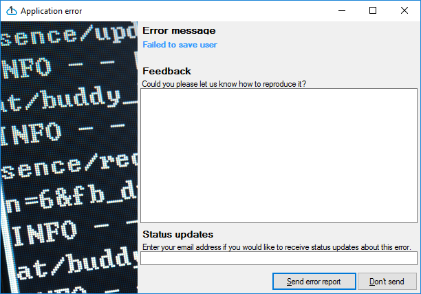
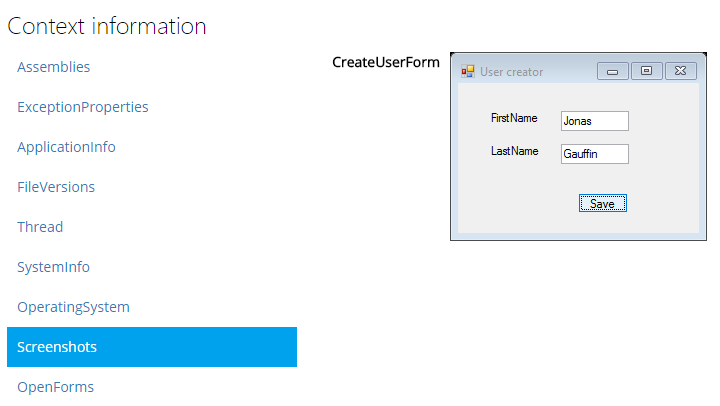

Integration library for WinForms applications
=============================================

[]() []()

This library will detect all unhandled exceptions in WinForms based applications and report them to your Coderr server.


<br>
*Built in error page*


<br>
*Example of captured screenshot when an exception was detected*

# Installation

1. Download and install the [codeRR server](https://github.com/coderrio/coderr.server) or create an account at [coderr.io](https://coderr.io)
2. Install this client library (using nuget `coderr.client.winforms`)
3. Configure the credentials from your codeRR account in your `Program.cs`.

### Example configuration

```csharp
public class Program
{
	public static void Main(string[] args)
	{

		// codeRR configuration
		var uri = new Uri("https://report.coderrapp.com/");
		Err.Configuration.Credentials(uri,
			"yourAppKey",
			"yourSharedSecret");

		// to catch unhandled exceptions
		Err.Configuration.CatchWinFormsExceptions();

		// different types of configuration options
		Err.Configuration.TakeScreenshotOfActiveFormOnly();
		Err.Configuration.TakeScreenshots();
		Err.Configuration.UserInteraction.AskUserForDetails = true;
		Err.Configuration.UserInteraction.AskUserForPermission = true;
		Err.Configuration.UserInteraction.AskForEmailAddress = true;


		// The usual stuff
		Application.EnableVisualStyles();
		Application.SetCompatibleTextRenderingDefault(false);
		Application.Run(new MainForm());
	}
}
```

# Getting started

All unhandled exceptions are reported manually. 
But sometimes you need to deal with exceptions yourself. 

When doing so, simply report the exception like this:

```csharp
public void OnPostClick()
{
	var model = CreatePostDto();

	try
	{
		_somService.Execute(model);
	}
	catch (Exception ex)
	{
		this.ReportException(ex, model);

		//some custom handling
	}
}
```

# Context collections

This library includes the following context collections for every reported exceptions:

* All in the [core library](https://github.com/coderrio/coderr.client)
* One property collection for each open form.
* Screenshot of the active form (the one that threw an exception)

# Requirements

You need to either install [Coderr Community Server](https://github.com/coderrio/coderr.server) or use [Coderr Cloud Service](https://app.coderr.io).

# Help?

* Questions? http://discuss.coderr.io
* Documentation: https://coderr.io/documentation/client/libraries/winforms/

